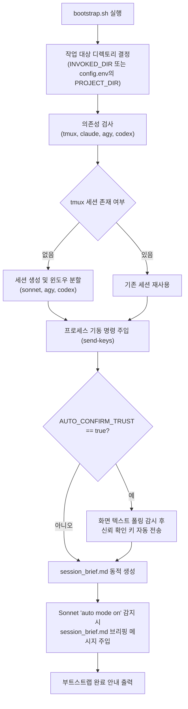
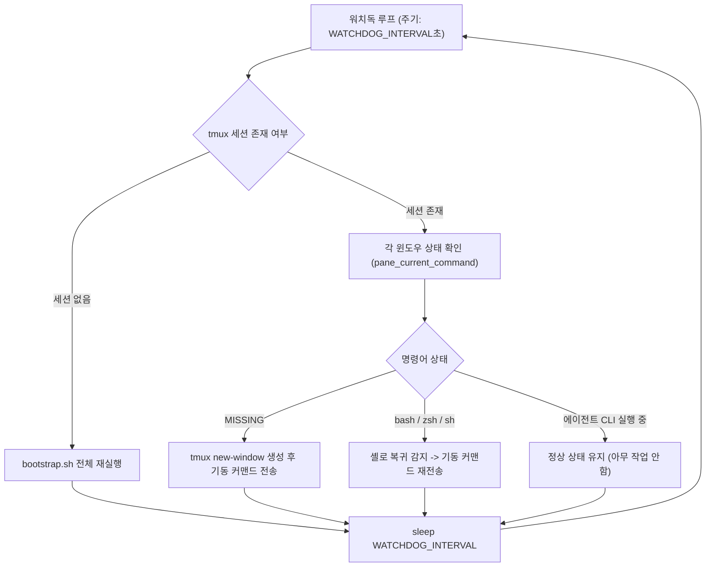

# Architecture & Bridge Design

`agent-command-chain-template`는 SQLite 상태머신, 헬스체크 데몬, 프로세스 간 RPC 브로커 같은 복잡한 외부 하네스 없이 **단일 tmux 세션의 3개 윈도우와 표준 터미널 I/O(send-keys, capture-pane, pipe-pane)**만으로 다중 에이전트 명령계통을 형성한다.

---

## 1. 4계층 명령계통 구조

```
[계층 0: 사용자 (사람)]
       │ (RC / 원격 개입 또는 직접 tmux attach)
       ▼
[계층 1: 감독/디스패치 (Claude Sonnet)] ────────────── (고난도 플래닝 필요시 일회성 Opus 상담)
       │
       ├─────────────────────────────────┐ (Sonnet 수동 디스패치 / send-keys)
       ▼                                 ▼
[계층 2: 라우터 겸 워커 (agy)]      [계층 2-내부 Tier 2: 작업 설계·수행 (Codex Terra)]
(Gemini 3.8 Flash, 일상 작업)       (gpt-5.6-terra, 중난도 설계 및 구현)
       │                                 │
       └─ (결과 보고 / 한계 명시) ─────────┴─ (필요시 gpt-5.6-sol 커맨드 전환 일회성 상담)
```

| 계층 | 주체 | 실행 환경 / 윈도우 | 주요 역할 | 특징 |
|---|---|---|---|---|
| **0. 사용자** | 사람 | 외부 클라이언트 / RC 웹 UI | 최종 의사결정 및 승인 | `claude --remote-control`을 통해 브라우저에서 개입 |
| **1. 감독/디스패치** | Claude Sonnet | tmux window `sonnet` | 모니터링, 작업 분배, 감사, 사용자 명령 하달 | 항상 사람과 맞닿아 있으며 agy와 codex 창을 모니터링 및 제어 |
| **2. 라우터 겸 워커** | agy (Gemini 3.8 Flash) | tmux window `agy` | 일상적 프로젝트 구현 및 난이도 판단 | 상시 대화형 지속. 처리 불가 시 "Terra급 작업 필요" 명시 보고 |
| **2-내부 Tier 2** | Codex Terra | tmux window `codex` | 중난도 작업 설계 및 직접 수행 | 대화형 TUI 모드로 상시 기동 (`codex --model gpt-5.6-terra`) |
| **2-내부 Tier 3** | Sol / Opus | 상시 창 없음 (필요 시 호출) | 최고난도 문제 및 전체 플래닝 상담 | codex 창의 커맨드를 `gpt-5.6-sol`로 전환하거나, Sonnet 창에서 `--model opus` 일회성 실행 |

> **핵심 설계 결정: 상시 창은 3개만 유지**
> Sonnet은 오직 `agy`와 `codex`(Terra) 두 창만 직접 관찰한다. Tier 3(Sol/Opus)를 상시 프로세스로 띄우지 않아 리소스 낭비를 줄이고 명령 계통의 혼선을 방지한다.

---

## 2. 브리지 설계 (tmux Bridge)

모든 CLI 프로세스는 단일 WSL Ubuntu tmux 세션(`$SESSION_NAME`, 기본값 `agentchain`) 내부에서 실행된다.

```
tmux session: agentchain
 ├─ window 0 "sonnet": claude --model sonnet --remote-control
 ├─ window 1 "agy":    agy --new-project --mode plan
 └─ window 2 "codex":  codex --model gpt-5.6-terra -s danger-full-access
```

### Pull 기반 관찰 및 제어 모델
- **Push 없는 Pull 구조**: tmux는 근본적으로 pull 모델이다. Sonnet이나 감시 스크립트는 필요할 때 `tmux capture-pane -p`로 대상 창의 화면 텍스트를 스냅샷 형태로 가져온다.
- **스트림 감지 대안**: 비동기 스트림 감지가 필요할 경우 `tmux pipe-pane -o -t <target> 'cat >> logs/<target>.pane.log'`를 통해 로그 파일로 흘려보내고, 파일 감시(tail) 방식을 취한다.
- **명령 주입**: 상위 제어자가 하위 창에 작업을 지시할 때는 `tmux send-keys -t <target> "지시문" C-m`을 호출한다.
- **agy ↔ Codex 간 비자동화**: agy는 Codex를 직접 서브프로세스로 실행하거나 제어하지 않는다. Sonnet(또는 사람)이 agy 출력에서 "Terra급 작업 필요" 신호를 감지하고 Codex 창에 지시문을 수동으로 넘긴다.

---

## 3. bootstrap.sh 동작 흐름

`bootstrap.sh`는 원클릭으로 세션 생성부터 초기 오리엔테이션까지 완료하는 진입점 스크립트다.



### 상세 실행 단계
1. **작업 경로 결정**:
   - 스크립트가 실행된 디렉토리(`$INVOKED_DIR`)가 작업 대상 프로젝트(`$PROJECT_DIR`)가 된다.
   - `config.env`에 `PROJECT_DIR`이 정의되어 있다면 해당 경로를 우선 채택한다.
2. **환경 변수 및 의존성 준비**:
   - 비대화형 실행 환경을 고려해 `export PATH="$HOME/.local/bin:$PATH"`를 주입하여 `agy` 바이너리를 탐색 가능하도록 보장한다.
   - `tmux`, `claude` 설치 여부를 확인(미설치 시 exit 1)하고, `agy`, `codex`는 경고 메시지를 남긴다.
3. **세션 및 윈도우 생성**:
   - 지정된 `$SESSION_NAME` 세션이 없으면 `tmux new-session -d`로 생성하며, 3개 윈도우(`$SONNET_WINDOW`, `$AGY_WINDOW`, `$CODEX_WINDOW`)의 시작 경로를 모두 `$PROJECT_DIR`로 통일한다.
4. **프로세스 기동 파라미터**:
   - **Sonnet**: `export CLAUDE_CODE_FORCE_SESSION_PERSISTENCE=1; $SONNET_CMD --add-dir "$HERE"`
     - 자식 세션 판정으로 인한 transcript 비활성화 방지 플래그 주입.
     - 대상 프로젝트 디렉토리 외부에 위치한 템플릿 디렉토리(`$HERE`)의 브리핑 문서를 읽을 때 발생하는 인터랙티브 권한 확인 팝업을 억제하기 위해 `--add-dir` 적용.
   - **agy**: 대화형 지속 모드로 기동 (`$AGY_CMD`, 기본 `agy --new-project --mode plan`).
   - **Codex**: one-shot 명령인 `codex exec` 대신 순수 `codex` 대화형 TUI 모드로 기동 (`$CODEX_CMD`).
5. **폴더 신뢰(Trust confirmation) 자동 응답 (`AUTO_CONFIRM_TRUST`)**:
   - 새 디렉토리 첫 실행 시 대화형 프롬프트를 건너뛰기 위해 `wait_for_pane_text` 함수로 최대 15초간 화면 텍스트를 감시한다.
   - `sonnet` 창: `"trust this folder"` 감지 시 `Down` + `Enter` ("Yes, I trust this folder").
   - `codex` 창: `"trust the contents"` 감지 시 `Enter` ("Yes, continue").
6. **동적 오리엔테이션 메시지 전달**:
   - 실행 시점의 실제 세션명, 프로젝트 경로, 윈도우명이 기록된 `$HERE/$LOG_DIR/session_brief.md`를 생성한다.
   - Sonnet 창이 정상 기동되어 `"auto mode on"` 상태가 감지되면, `session_brief.md`를 읽고 역할을 인지하도록 메시지를 `send-keys`로 전송한다.

---

## 4. watchdog.sh 동작 흐름

`watchdog.sh`는 프로세스 장애 발생 시 최소한의 생존을 보장하는 느슨한(Loose) 워치독이다.



### 무상태 복구 메커니즘
- `tmux display-message -p -t "${SESSION_NAME}:${window}" '#{pane_current_command}'`를 실행해 각 창의 활성 명령어를 검사한다.
- 프로세스가 비정상 종료되어 셸(`bash`, `zsh`, `sh` 등)로 복귀한 경우 프로세스 사망으로 판단하고 기동 커맨드를 재전송한다.
- 윈도우 자체가 닫힌 경우(`MISSING`) `$PROJECT_DIR` 경로에서 새 윈도우를 열고 커맨드를 실행한다.
- 세션 전체가 파괴된 경우 `PROJECT_DIR="$PROJECT_DIR" ./bootstrap.sh`를 실행해 복구한다.
- 복잡한 락 파일, 분산 하트비트 없이 셸 커맨드 상태 검사만으로 단순하고 견고하게 동작한다.
