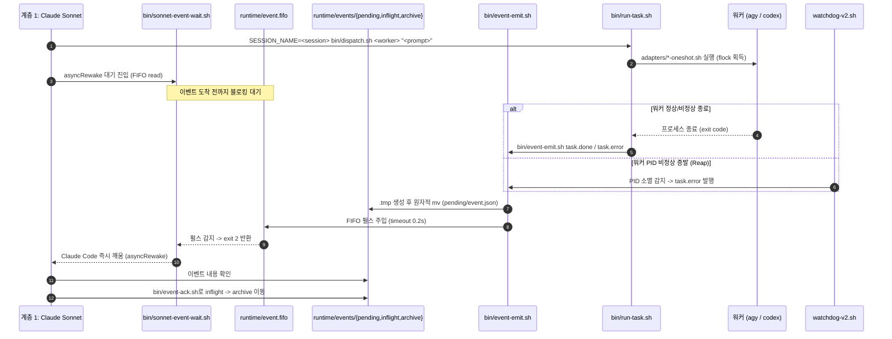

# Architecture

`agent-command-chain-template`의 4계층 역할 구조, Full-Push v2 브리지 아키텍처, Stage 1 Resident TUI 모드, 읽기 전용 상태 대시보드, 그리고 v1 폴백 브리지 설계를 설명한다.
신규 세션에서 환경을 재현하거나 중단된 작업을 이어받는 운영 절차는 [[session-resume]]를 참조한다.

---

## 1. 역할 구조 (4계층)

| 계층 | 주체 | 실행 환경 / 윈도우 | 주요 역할 | 특징 |
|---|---|---|---|---|
| **0. 사용자** | 사람 | 외부 클라이언트 / RC 웹 UI | 최종 의사결정 및 승인 | `claude --remote-control`을 통해 브라우저에서 개입 |
| **1. 감독/디스패치** | Claude Sonnet | tmux window `sonnet` | 모니터링, 작업 분배, 감사, 사용자 명령 하달 | 사람과의 상시 소통 창구. 실질 작업은 스스로 하지 않고 agy/codex에 위임 |
| **2. 라우터 겸 워커 총괄** | agy (Gemini 3.8 Flash) | tmux window `agy` | 난이도 판단 및 워커 서브에이전트 위임·총괄 | v2 단발 실행(oneshot 한 턴) 라우팅 또는 Stage 1 상주 TUI 모드. 직접 작업(Read/Bash/Edit) 금지 및 내장 도구 `invoke_subagent`로 위임. 실패 시 `[[BLOCKED]]` 에스컬레이션. (v1 상주 TUI responsive state는 legacy) |
| **2-내부 Tier 2** | Codex Terra | tmux window `codex` | 중난도 작업 설계 및 직접 수행 | 단발 어댑터(`adapters/codex-oneshot.sh`) 또는 대화형 TUI 기동. agy가 자동 호출하지 않음 |
| **2-내부 Tier 3** | Sol / Opus | 상시 창 없음 (필요 시 호출) | 최고난도 문제 및 전체 플래닝 상담 | codex 창의 커맨드를 Sol 계열 최신(`resolve-model.sh sol`)으로 전환하거나, Sonnet 창에서 `--model opus` 일회성 실행 |

### 핵심 아키텍처 단순화 및 원칙
- **계층 단순화**: Sonnet은 agy와 codex(Terra) 두 창만 직접 봅니다. eraweb-fork의 "Terra가 agy 보고를 정규화해서 Sol에게만 전달, agy는 Sol에 직접 보고 안 함" 규칙을 계층 구조 자체로 끌어올린 것입니다.
- **agy → codex 자동 연동이 없는 이유**: eraweb-fork에서 agy가 Terra/Sol을 실제로 호출하는 로직은 `tools/router/src/adapters/*.ts`(Node `child_process.spawn`)에 있었으나, 본 템플릿은 외부 라우터 엔진 하네스를 배제하고 경량화하기 위해 해당 레이어를 의도적으로 제외했습니다. 따라서 codex 창은 agy와 자동으로 연동되지 않으며, Sonnet(또는 사람)이 agy 출력을 보고 필요하다고 판단되면 codex 창에 직접 `send-keys`로 작업을 넘깁니다. (진짜 자동 연동이 필요해지면 eraweb-fork의 라우터 어댑터를 참고하여 별도 구현)
- **Sol/Opus가 상시 창이 없는 이유**: 사용 빈도가 낮고(최고난도 상담), 상시 프로세스를 켜두는 것보다 필요할 때 `codex` 창 커맨드를 Sol 계열 최신(`resolve-model.sh sol`)으로 바꾸거나 Sonnet 세션에서 `--model opus`로 일회성 실행하는 것이 자원상 훨씬 가볍기 때문입니다.

---

## 2. Full-Push v2 브리지 아키텍처 (기본 권장)

### 2.1 이벤트 통지 및 비동기 기상 흐름



### 2.2 POSIX FIFO + Durable Outbox 설계

v2는 메시지 유실 없는 신뢰성을 달성하기 위해 **파일 기반 Durable Outbox 패턴**과 **비동기 POSIX FIFO 펄스**를 결합했습니다.

- **디렉토리 레이아웃 (`$ACC_RUNTIME`)**:
  - `runtime/events/pending/`: 발행되었으나 아직 Sonnet이 확인하지 않은 이벤트
  - `runtime/events/inflight/`: 워치독 또는 처리기가 확인 중인 이벤트
  - `runtime/events/archive/`: 처리가 완료(`event-ack.sh`)되어 보관된 이벤트
  - `runtime/tasks/<task_id>/`: 작업 명세(`spec.json`), 상태(`state.json`), 실행 로그(`output.log`)
  - `runtime/workers/`: 워커별 상태 및 터미널 락
  - `runtime/event.fifo`: Claude Code `asyncRewake` 전용 비동기 시그널 FIFO
- **원자적 커밋 (Atomic Commit)**: 모든 상태 변경과 이벤트 스풀링은 `.tmp` 임시 파일을 먼저 작성한 후 원자적 `mv`를 통해 수행되므로, 읽는 측에서 부분 기록(torn write)을 읽는 일이 원천 차단됩니다.
- **데드락 방지 FIFO 펄스**: `bin/event-emit.sh`는 이벤트를 디스크에 안전하게 쓴 후 FIFO에 1바이트 펄스를 보낼 때 `timeout 0.2` 비동기 쓰기를 사용하여 리스너 부재로 인한 송신자 영구 블로킹을 방지합니다.

### 2.3 bin/ 핵심 스크립트 역할

| 스크립트 | 역할 및 핵심 메커니즘 |
|---|---|
| **`bin/event-emit.sh`** | **원자적 이벤트 발행기**. Outbox의 `pending/` 디렉토리에 이벤트를 안전하게 원자적 스풀링하고, `event.fifo`에 논블로킹 펄스를 전송하여 대기 중인 리스너를 깨웁니다. `outbox.lock` flock을 통해 동시 발행 경쟁을 보호합니다. |
| **`bin/sonnet-event-wait.sh`** | **Claude Code `asyncRewake` 전용 리스너**. `runtime/event.fifo`를 감시하다가 펄스가 들어오거나 미확인 pending 이벤트가 감지되면 exit code `2`를 반환하여 Claude Code를 즉각 기상시킵니다. |
| **`bin/event-ack.sh`** | **이벤트 완료 처리기**. Sonnet이 확인한 이벤트를 `archive/` 디렉토리로 원자적으로 이동시키고 FIFO에 남은 잔여 펄스를 드레인하여 중복 기상을 방지합니다. |
| **`bin/dispatch.sh`** | **작업 디스패처**. 4계층 세션명 자동 해석(환경변수 `SESSION_NAME` 권장, 런타임 마커, 현재 tmux 세션, config 기본값) 및 v2 마커 검증 후, 고유 작업 ID 발급 및 실행 프롬프트 사본(`$task_dir/prompt.md`) 생성 시 체인 컨텍스트 헤더(< 1KB) 자동 주입(`ACC_NO_BRIEF_HEADER=1`로 비활성화 가능, 헤더 포함 128KB 제한 검증). `oneshot` 모드에서는 `bin/run-task.sh` 명령을 주입하고, `resident` 모드에서는 1줄 도어벨 트리거(`Read and execute task prompt: ...`)를 주입합니다. `--dry-run` 안전 검증 플래그 지원. |
| **`bin/run-task.sh`** | **워커 프로세스 러너 (oneshot 전용)**. 터미널 소유권 락(`terminal.lock`)을 획득하고 작업 상태를 `running`으로 전이한 뒤, 지정된 어댑터를 실행합니다. 실행 완료 시 성공/실패 여부에 따라 `task.done` 또는 `task.error` 이벤트를 원자적으로 발행합니다. |
| **`bin/agy-stop-hook.sh`** | **agy Stop 훅 핸들러 (resident 전용)**. Antigravity CLI의 `Stop` 라이프사이클 훅으로부터 stdin JSON을 수신하여 `fullyIdle: true` 여부 및 서브에이전트 여부를 판별합니다. `terminal.lock` 멱등성을 보장하며 원자적 `done` 또는 `error` 이벤트를 Outbox에 발행하고 작업 상태와 `workers/agy.busy`를 안전하게 정리합니다. |
| **`adapters/agy-oneshot.sh`** | **agy 단발 실행 어댑터**. Antigravity CLI를 비대화형 단발 모드로 구동하여 명세된 프롬프트를 수행합니다. 메인 턴에서 `invoke_subagent` 도구를 통해 워커 서브에이전트를 기동·취합하고 종료합니다. |
| **`adapters/codex-oneshot.sh`** | **Codex 단발 실행 어댑터**. `codex exec` 기반으로 단발성 설계/코딩 작업을 수행합니다. 비-Git 프로젝트용 `--skip-git-repo-check` 플래그를 포함합니다. |

### 2.4 커널 자동 해제형 Terminal Ownership Flock 및 Worker Lease

분산 락이나 파일 기반 PID 플래그는 프로세스가 `SIGKILL`을 맞거나 OS 비정상 종료 시 Stale Lock으로 남아 시스템이 영구 고착되는 취약점이 있습니다. v2는 이를 해결하기 위해 **Linux 커널 레벨 `flock`**을 도입했습니다:

1. **커널 레벨 자동 수거**:
   - `bin/run-task.sh`는 작업 시작 시 `flock -n`으로 대상 터미널의 FD 락을 잡습니다.
   - 프로세스가 정상 종료되든, `kill -9`로 즉사하든, 커널이 프로세스 테이블을 정리하면서 해당 열린 FD(File Descriptor)를 자동으로 닫고 락을 즉각 해제합니다.
2. **단일 결정적 Terminal ID**:
   - 경쟁 조건 및 식별자 불일치 방지를 위해 워커별 터미널 ID를 `${task_id}-terminal` 고정 규칙으로 일원화했습니다.
3. **`flock --close` 자가 래퍼**:
   - 셸 스크립트에서 fork된 자식 프로세스가 부모의 FD를 상속받아 락을 의도치 않게 계속 쥐고 있는 버그를 방지하기 위해, `exec flock -n -E 0 --close ...` 자가 래퍼 패턴을 적용하여 자식 프로세스 포크 시 락 FD가 상속되지 않도록 원천 차단했습니다.

### 2.5 watchdog-v2.sh의 4대 안전망

`watchdog-v2.sh`는 60초 주기로 백그라운드에서 동작하며, 분산 에이전트 시스템에서 발생 가능한 4대 비정상 상태를 전담 감시하고 복구합니다:

```
                  watchdog-v2.sh (4대 안전망)
                               │
   ┌───────────────────┬───────┴───────────┬───────────────────┐
   ▼                   ▼                   ▼                   ▼
[1. 세션/Sonnet 증발] [2. PID 증발 Reap] [3. Deadline/Stall] [4. 브리지 정체 해소]
tmux 세션 부재 시    running인데 PID 소멸  DEFAULT_TASK_TIMEOUT ACK 타임아웃(10분)
bootstrap-v2 재실행   원자적 fail+이벤트   초과 경고/알림 발행  초과 이벤트 pending 복구
```

1. **세션 / Sonnet 증발 감시**:
   - tmux 세션 자체가 파괴되었거나 Sonnet 프로세스가 종료된 경우, `bootstrap-v2.sh`를 자동 호출하여 환경을 복구합니다.
2. **PID 증발 비정상 작업 원자적 수거 (Reap)**:
   - 작업 상태가 `running`인데 기록된 워커 PID가 프로세스 테이블에 존재하지 않는 경우(crash, OOM 등), 상태 변수(`state_committed`)를 안전하게 초기화하고 작업을 `error`로 전이시키며 `task.error` 이벤트를 발행합니다. 작업이 확실히 커밋된 경우에만 워커의 `busy` 상태를 해제하여 데이터 일관성을 보장합니다.
3. **Deadline 및 Stall 초과 감시**:
   - **Deadline**: 작업 실행 시간이 `DEFAULT_TASK_TIMEOUT`(기본 1800초/30분)을 초과하면 `task.deadline_exceeded` 이벤트를 발행하고 `deadline.notified` 플래그를 원자적으로 생성하여 중복 알림을 방지합니다.
   - **Stall**: 워커 출력 로그(`output.log`)가 `NO_OUTPUT_WARN_SECONDS`(기본 900초/15분) 동안 1바이트도 갱신되지 않으면 무응답 스톨 경고를 기록합니다.
4. **브리지 정체 해소 (ACK Timeout Recovery)**:
   - `inflight` 상태로 전환된 이벤트가 `EVENT_ACK_TIMEOUT`(기본 600초/10분) 동안 Sonnet에 의해 ACK 처리되지 않으면, 상위 세션 일시 지연으로 판단하고 이벤트를 다시 `pending`으로 롤백 인계하여 영구 분실을 방지합니다.

### 2.6 Sentinel 통신 프로토콜 및 2층 감사 체계

v2 Full-Push 아키텍처는 기계적 신뢰성(Durable Outbox)과 사람/감독자의 가독성을 결합하기 위해 2계층 통신 및 감사 구조를 채택합니다:

1. **상태 Sentinel 규격 (모니터링용)**:
   - `[[ACK <id>]]`: 작업 수신 및 착수 확인.
   - `[[DONE <id>]] result=<요약> | learning=<한줄|none>`: 작업 완료 및 1줄 학습 캡슐.
   - `[[BLOCKED <id>]] reason=<subagent-unavailable|ambiguous-spec|needs-terra>`: 차단 및 에스컬레이션.
2. **완료 판정의 단일 진실 공급원 (SSOT)**:
   - **원칙**: 상기 Sentinel은 사람이 읽고 관찰하기 위한 출력 포맷이다.
   - **SSOT**: 작업의 실제 성공/실패 및 완료 판정은 반드시 **v2 Durable Outbox 이벤트(`run-task.sh`가 발행하는 `runtime/events/pending/<id>.evt`)**를 기준으로 이루어진다.
3. **2층 감사 구조 (Two-Tier Audit)**:
   - **1층 (자기 보고 검토)**: 워커가 최종 보고에 제출한 `refs_loaded`(실제 열람 문서)와 `learning_capsule` 검토.
   - **2층 (물리 로그 대조)**: `$ACC_RUNTIME/tasks/<task_id>/output.log` 및 Antigravity transcript 상의 실제 도구 호출 내역(`view_file`, `Read` 등)을 교차 검증하여 보고와 실측 간 불일치를 감사.

### 2.7 체인 컨텍스트 헤더 자동 주입 (Brief Context Header)

디스패치 시 워커가 프로젝트 디렉토리 외부의 체인 규칙과 위키 경로를 즉시 인지할 수 있도록, `bin/dispatch.sh`는 실행용 프롬프트 사본(`$task_dir/prompt.md`) 앞에 1KB 미만의 경량 체인 컨텍스트 헤더를 자동으로 prepend합니다:
- **헤더 내용**: `TEMPLATE_ROOT`, `CHAIN_WIKI_INDEX`, `ROLES`, `PROJECT_DIR`, `SESSION_NAME`, `TASK_ID`, 워커별 핵심 규칙(agy oneshot 위임 및 BLOCKED 보고 규정, Codex 프로젝트 컨벤션 우선 원칙).
- **원본 보존**: 사용자가 지정한 원본 프롬프트 파일은 절대 변경되지 않으며, 태스크 실행 사본에만 헤더가 합성됩니다.
- **비활성화 스위치**: 환경변수 `ACC_NO_BRIEF_HEADER=1`을 설정하고 디스패치하면 헤더 주입이 비활성화됩니다.
- **128KB 크기 가드**: 헤더가 합성된 최종 프롬프트 크기는 Linux `ARG_MAX` 및 모델 입력 한도를 준수하기 위해 128KB(131,072 바이트) 이내로 검증되며 초과 시 즉시 거부(`exit 65`)됩니다.

### 2.8 Resident TUI 브리지 (Stage 1: agy 상주 + codex oneshot)

과제 `T0924-09`에서 구현된 Resident TUI 브리지 Stage 1은 사용자가 직접 agy 창을 터미널에서 관찰할 수 있도록 대화형 TUI 상주를 지원하면서, 기존 Full-Push v2 브리지의 무폴링 통지 및 안전망을 100% 결합한 하이브리드 아키텍처입니다:

1. **워커 모드 분기 (Worker Mode Resolution)**:
   - 기본값은 `WORKER_MODE=oneshot`으로 100% 무회귀 원복 경로를 유지합니다.
   - 개별 워커별로 `AGY_MODE=resident` 및 `CODEX_MODE=oneshot`을 설정할 수 있습니다.
2. **도어벨과 페이로드 분리 (Doorbell vs Payload Separation)**:
   - 디스패처(`bin/dispatch.sh`)는 프롬프트 전문과 헤더를 `$ACC_RUNTIME/tasks/<task_id>/prompt.md` 파일에 기록하고, `workers/agy.busy`를 선점합니다.
   - tmux 창에는 오직 1줄 도어벨(`Read and execute task prompt: $task_dir/prompt.md`)만 주입하여 개행 폭주와 터미널 버퍼 오염을 원천 방지합니다.
3. **무폴링 완료 통지 (Native Stop Hook + fullyIdle)**:
   - agy가 작업을 수행하는 동안 서브에이전트 구동 턴에서는 `fullyIdle: false`이므로 훅이 대기합니다.
   - 모든 서브에이전트가 완료되고 메인이 요약을 마치면 `fullyIdle: true`로 `bin/agy-stop-hook.sh`가 발동하여 `bin/event-emit.sh`를 통해 Outbox와 FIFO에 원자적 `done` 이벤트를 주입합니다.
   - `terminal.lock` 기반 멱등성 보장으로 중복 통지를 차단하며, `workers/agy.busy`가 없는 상태의 `/clear`나 수동 입력은 이벤트를 발행하지 않습니다.
   - **Fail-Closed 4중 가드 원칙 (Hook Fail-Closed Rules)**:
     1. `ACC_RUNTIME` 환경변수가 명시적으로 지정되어 있고 디렉토리이며, `workers/agy.resident` 마커 파일이 존재할 때만 진입 (런타임 추측/config.env 폴백 전면 제거).
     2. `workers/agy.resident` 내 기록된 `pane_id`와 hook 실행 환경의 `TMUX_PANE`이 일치할 때만 진입 (상주 창 이외 agy 프로세스의 Stop 훅 오반응 차단).
     3. 활성 작업 상태 파일(`state`) 내 `mode=resident` 및 `status=running`이 모두 만족될 때만 이벤트 발행 (oneshot 작업이나 이미 완료된 작업 오반응 차단).
     4. 상기 조건 미충족 시 무작업(no-op)으로 `{"decision":"allow"}`를 표준 출력하고 파일 변조 없이 즉시 안전 종료.
4. **프로젝트 비침범 머신 전역 훅 구성 (Zero Project Pollution)**:
   - 대상 프로젝트 리포지토리에 `.agents/hooks.json`을 강제하지 않고, 머신 전역 위치인 `~/.gemini/config/hooks.json`의 독립 키(`"agent-command-chain-bridge"`)를 활용하여 다중 프로젝트에 무침범 적용됩니다.
5. **상주 감시 워치독 (`watchdog-v2.sh`)**:
   - 상주 워커 창의 커맨드가 TUI에서 이탈(`pane_current_command != worker`)하거나 PID가 소멸할 경우 `process_exit`로 원자적 수거(reap)를 수행합니다.
   - Antigravity CLI 트랜스크립트(`transcript_full.jsonl`)의 `mtime`을 무폴링 활동 신호로 채택하여 비정상 정체(`NO_OUTPUT_WARN_SECONDS`)를 정밀 감시합니다.
   - `SIGSTOP` 시그널로 일시정지된 프로세스를 사망(reap)으로 오인하지 않고 `stalled` 정체 경고 이벤트를 발행합니다.
   - 명시적 `ACC_RUNTIME` 인자 누락 시 fail-closed 거부하여 운영 런타임 오염을 원천 차단합니다.
6. **단순 `/clear` 및 1줄 재무장**:
   - 다단 핸드셰이크 없이 유휴 상태(`busy` 부재)에서 `/clear` 후 1줄 재무장 프롬프트(`ACC_ROLE:...`)를 주입하여 대화 맥락을 즉시 소거하고 역할을 재장착합니다.

### 2.9 테스트 하네스 격리 규약 및 운영 런타임 보호 체계 (Test Harness Isolation & Live Protection)

과제 `T0924-09`에서 발생한 운영 런타임 변조 사고를 교훈 삼아, `tests/` 하네스는 완전한 격리 실행 및 엄격한 무오염 단언 체계를 구축했습니다 (`tests/lib-isolated-env.sh`):

1. **깨끗한 실행 환경 강제 (`run_clean`)**:
   - 모든 테스트 명령은 `env -i PATH="$PATH" HOME="$TEST_HOME" ...`로 부모 프로세스로부터 상속된 환경변수를 100% 제거한 뒤, 명시적으로 허용된 변수만 주입하여 실행합니다.
2. **동적 마커 검증 (`TESTMARK-<random>`)**:
   - 매 테스트 실행마다 암호학적 난수 기반 마커(`TESTMARK-<random>`)를 발급하여 모든 페이로드, 프롬프트, 요약문에 삽입합니다.
   - **Guard Check 2**: 테스트 시작 및 teardown 시 실제 운영 런타임(`$LIVE_RT`) 전체를 대상으로 `grep -r "$TESTMARK" "$LIVE_RT"`를 수행하여 일치 건수가 **정확히 0건**이어야 함을 단언하며, 단 1건이라도 발견 시 즉시 테스트를 실패 처리합니다.
3. **런타임 경로 오버랩 원천 차단 (Guard Check 1)**:
   - 임시 런타임 경로가 운영 런타임(`$LIVE_RT`)과 같거나 그 하위 디렉토리인 경우 테스트를 즉시 abort합니다.
4. **독립 tmux 세션 격리 및 자동 정리**:
   - 모든 tmux 명령은 `-t <session_name>`을 강제하며, 테스트 세션(`acc-t0924-10-<rand>`)은 trap에 의해 EXIT/INT/TERM 발생 시 즉각 자동 회수됩니다.

### 2.10 읽기 전용 상태 대시보드 (`dashboard/`)

`dashboard/`는 전체 체인의 상태를 관찰할 수 있도록 제공되는 완전 읽기 전용 웹 모니터링 하위 시스템입니다:
1. **표준 라이브러리 전용 서버 (`server.py`)**:
   - 외부 종속성 없이 Python 3 내장 라이브러리만으로 동작합니다.
   - 기본적으로 Tailscale IPv4 주소에 바인딩되어 안전한 사설망(tailnet) 내에서만 접속 가능하며, `0.0.0.0` 바인딩은 `--allow-any-host` 플래그를 통해서만 허용됩니다.
2. **완전 읽기 전용 및 보안 격리**:
   - 서버는 디스크에 어떠한 파일도 쓰지 않으며 모든 캐시는 인메모리(2초)로만 관리됩니다.
   - 트랜스크립트 파일 접근 시 엄격한 정규화 및 화이트리스트 검증을 수행하여 상위 디렉터리 탈출 시도를 원천 차단합니다.
   - 작업 단위 정밀 트랜스크립트 슬라이싱(exact, partial, inferred, none) 및 텍스트 절단 전 단일 지점 민감 정보 마스킹(`mask_sensitive`)을 적용합니다.

### 2.11 2계층 설정 구조 (2-Tier Configuration Architecture)

단일 체크아웃에서 복수 인스턴스를 안전하게 운용하기 위한 2계층 설정 계층화(`lib/config.sh::acc_load_config`), ID 유효성 검증, fail-closed 거부 규약 및 환경변수 최우선 원칙에 대한 상세 설명은 [[usage#2-설정-체계-및-계층화-2-tier-configuration]]을 참조한다.

---

## 3. tmux 브리지 (v1, 폴백/레거시)

v1 아키텍처는 추가적인 FIFO나 Outbox 없이 순수 tmux 내부 기능만을 활용하는 최소형 브리지입니다.

```
tmux session: agentchain (config.env의 SESSION_NAME)
 ├─ window 0 "sonnet": claude --model sonnet --remote-control --add-dir <템플릿경로>
 ├─ window 1 "agy":    agy --new-project --mode plan (대화형, 지속)
 └─ window 2 "codex":  codex --model "$(bin/resolve-model.sh sol)" -s danger-full-access (대화형, 지속)
```

- **동적 대상 디렉토리 (`PROJECT_DIR`)**: 세 창 모두 `bootstrap.sh`를 실행한 디렉토리(`PROJECT_DIR`)에서 시작합니다 (`-c "$PROJECT_DIR"`). 하드코딩된 프로젝트 경로는 없으며 실행 위치를 기준으로 동적으로 결정됩니다.
- **Pull 기반 관찰**: 상위 제어자가 `tmux capture-pane -p`로 대상 창 화면을 주기적으로 스냅샷 조회하거나, `pipe-pane`으로 로그를 파일로 흘려보내 관찰합니다. push는 근본적으로 없으며, 실시간성이 필요하면 `pipe-pane` 로그 tail이 가장 근접한 비동기 감지 수단입니다.
- **수동 지시**: `tmux send-keys -t <target> "지시문" C-m`으로 명령을 주입합니다.
- **v1 워치독 (`watchdog.sh`, 느슨한 폴백)**: 창이 셸(`bash`, `sh`)로 복귀하거나 창이 닫힌 경우 재기동 커맨드를 단순 재주입하는 무상태(stateless) 복구 방식으로 동작합니다. 리스, 하트비트, 스티키 라우팅 등의 복잡한 상태머신은 배제되어 있습니다.

---

## 4. 진입점 비교: bootstrap-v2.sh vs bootstrap.sh

| 비교 항목 | `bootstrap-v2.sh` (기본 권장 v2) | `bootstrap.sh` (폴백/레거시 v1) |
|---|---|---|
| **통지 방식** | Full-Push (FIFO + asyncRewake 즉시 깨우기) | Pull (tmux 화면 캡처 및 폴링) |
| **작업 실행 방식** | `bin/dispatch.sh` 기반 단발(oneshot) 어댑터 격리 실행 또는 Stage 1 상주 TUI | tmux 대화형 창에 직접 `send-keys` 입력 |
| **상태 관리** | `runtime/` 내 작업별 spec/state/log 완전 격리 및 Outbox 관리 | tmux 창 텍스트 화면 상태에 의존 |
| **워치독 연동** | `watchdog-v2.sh` 자동 백그라운드 기동 (`START_WATCHDOG=true`) | `watchdog.sh &` 수동 실행 권장 |
| **장애 복구** | PID Reap, 커널 flock, Deadline 초과, ACK 복구 등 4대 안전망 | 윈도우 프로세스 죽음 시 커맨드 재전송 |
| **사용 목적** | 프로덕션 다중 에이전트 자율 협업 | 최소 환경 테스트 및 비상 폴백 |
